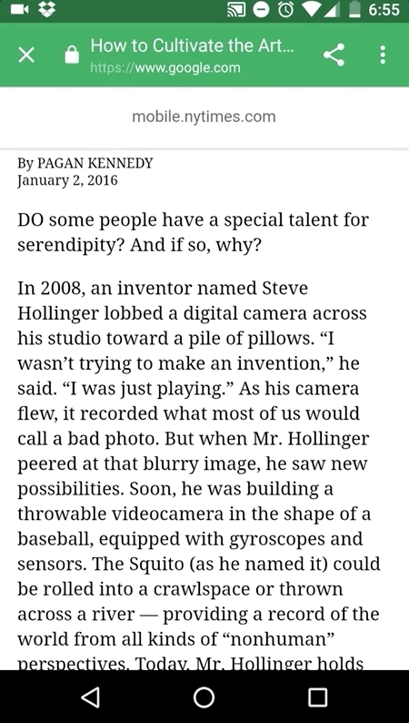
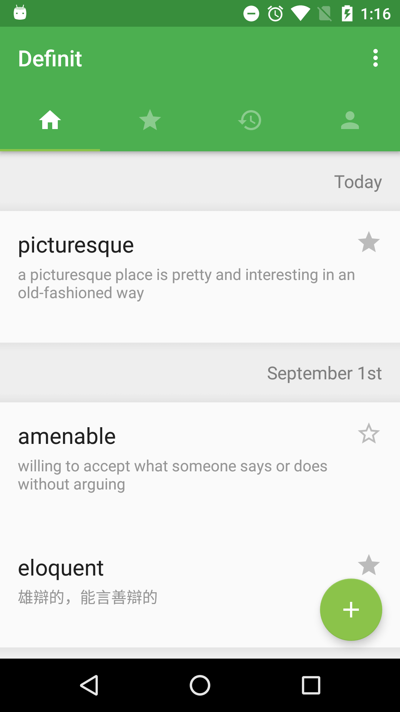
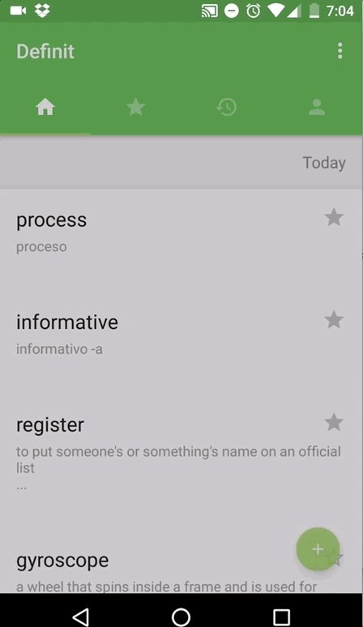

# Definit

Definit is an native Android app I created out of desire to help myself improve my measly vocabulary. I'd always heard from teachers that one of the best ways to expand one's vocabulary was by reading things and keeping track of the unknown words, and that is what this app aims to automate.

Flashcards are a secondary feature in this app. The main idea I was going for was implemented with the following:
this app allows you to define words from any screen, using a persistent notification (with speech and text input), and a convenient automatic pop-up that activates when a word is copied to the pasteboard (similar to Messenger chatheads). 
Another key feature that separates it from dictionaries I had previously used was the ability to do the above as well as save the words and context for later viewing, so that I could actually look back at all the words I had encountered, searched up and learned.

Convenient context/pasteboard word lookup  

Saving definitions for later review  

Development in Android Studio, targeting Nougat devices with support down to KitKat, opened a path to gain experience with Android support libraries and issues, floating windows, fragments, service and activity management, SQL, networking, Maven, Git, and UX and UI design. 

Design was a strong focus in this project -- I conducted user tested and carefully storyboarded on paper and with Adobe Illustrator. Making sure the app took Material Design and fleshed out its own identity was also something I was aiming for, with the inclusion of specific animations, and consistent color scheme.

Viewing words as flashcards
  

The main screen of the app, showing definitions saved by the user -- notice support for Chinese (and Spanish but it's not shown)! 

Other tabs include user-favorited words, search history, and user preferences.   
