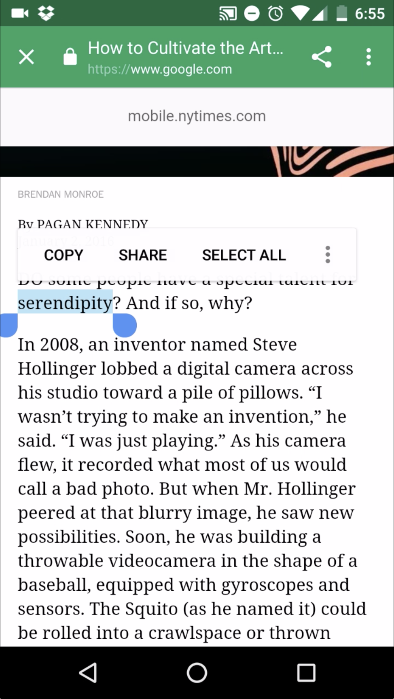
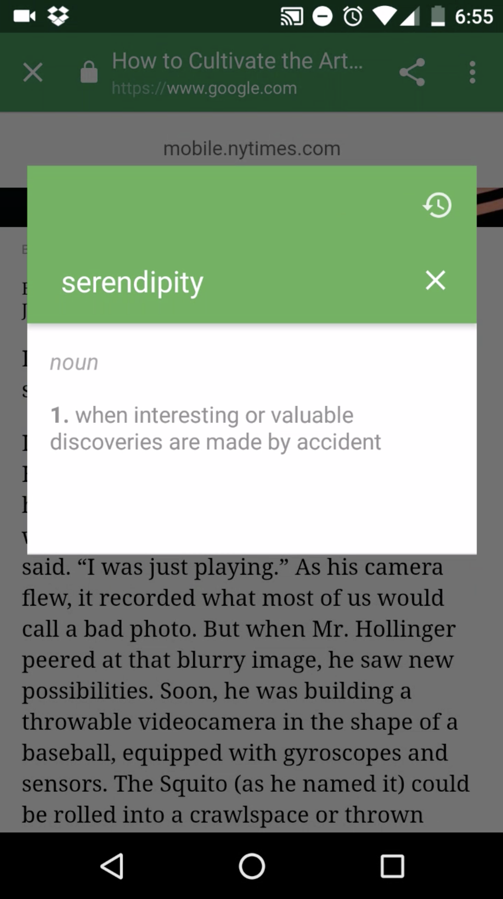

# Definit

I created this app out of desire to help myself improve my measly vocabulary. I'd always heard from teachers that one of the best ways to expand one's vocabulary was by reading things and keeping track of the unknown words, and that is what this app aims automate.

This app allows you to define words from any screen, using a persistent notification (with speech and text input), and a convenient automatic pop-up that activates when a word is copied to the pasteboard (similar to Messenger chatheads). 
Another key feature that separates it from dictionaries I had previously used was the ability to do the above as well as save the words for later viewing, so that I could actually look back at all the words I had encountered, searched up and learned. 

Development in Android Studio, targeting Nougat devices with support down to KitKat, opened a path to gain experience regarding Android support issues floating windows, fragments, service and activity management, SQL, networking, UX and UI design.

 {
  width: 40%;
  height: 40%
}

The main screen of the app, showing definitions saved by the user -- notice support for Chinese (and Spanish but it's not shown)!
Other tabs include user-favorited words, search history, and user preferences.

 {
  width: 40%;
  height: 40%
}
 {
  width: 40%;
  height: 40%
}
 {
  width: 40%;
  height: 40%
}
 {
  width: 40%;
  height: 40%
}

The process of defining a word "from any screen" with the pasteboard.